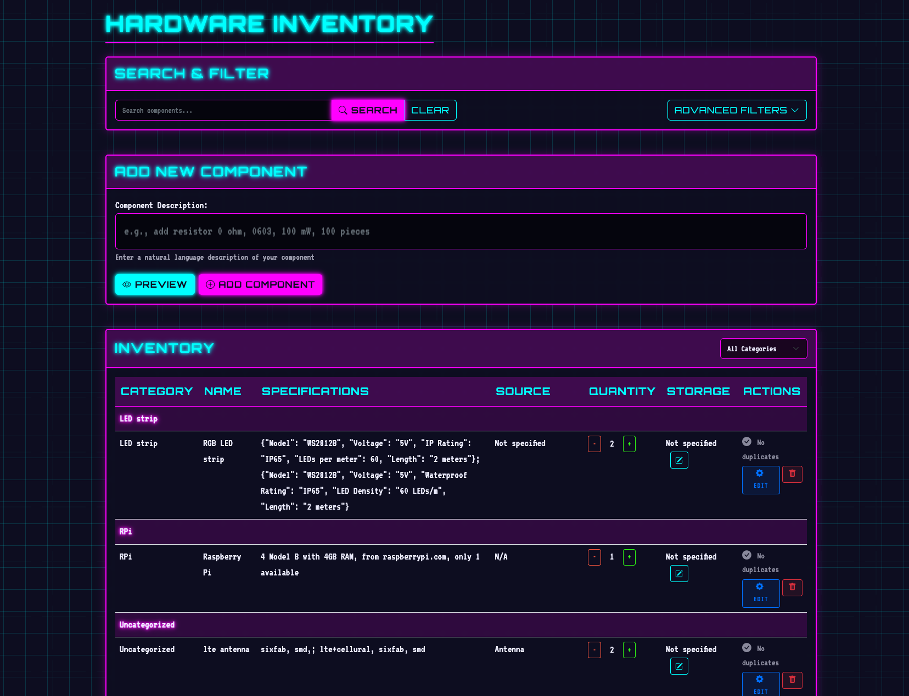

# 🖥️ Retro Hardware Inventory System


<p align="center">
  
  <br>
  <em>A synthwave-styled inventory management system for electronic components</em>
</p>

## ✨ Features

- **Retro 80s UI** - Neon colors, grid backgrounds, and synthwave aesthetics
- **Natural Language Input** - Add components using plain language descriptions
- **Duplicate Detection** - Automatic identification and merging of similar components
- **Category Management** - Organize components by custom categories
- **Search & Filter** - Find components by name, category, specifications, etc.
- **Visual Feedback** - Animated component additions with satisfying transitions
- **Storage Locations** - Track where components are physically stored
- **Quick Edit/Delete** - Efficient component management with minimal clicks
- **Component Highlighting** - New components stand out with glowing effects
- **Responsive Design** - Works on desktop and mobile devices

## 📸 Screenshots

<p align="center">
  
  
</p>
<p align="center">
  
  
</p>

## 🚀 Getting Started

### Prerequisites

- Python 3.8+
- pip (Python package manager)
- A modern web browser

### Installation

1. **Clone the repository**
   ```bash
   git clone https://github.com/yourusername/retro-hardware-inventory.git
   cd retro-hardware-inventory
   ```

2. **Set up a virtual environment (recommended)**
   ```bash
   python -m venv venv
   source venv/bin/activate  # On Windows: venv\Scripts\activate
   ```

3. **Install dependencies**
   ```bash
   pip install -r requirements.txt
   ```

4. **Configure environment variables**
   ```bash
   cp .env.example .env
   # Edit .env with your configuration
   ```

5. **Initialize the database**
   ```bash
   python -c "from database import init_db; init_db()"
   ```

6. **Run the application**
   ```bash
   python app.py
   ```

7. **Access the inventory system**
   Open your browser and navigate to `http://localhost:5000`

## 💻 Usage

### Adding Components

Simply type a description of your component in the input field:

```
10x 1N4148 diodes from Mouser, stored in Drawer B2
```

The system will parse the input and extract:
- Component name (1N4148 diodes)
- Quantity (10)
- Source (Mouser)
- Storage location (Drawer B2)

### Finding Components

1. Use the search bar to quickly find components
2. Apply filters for more specific searches:
   - By category
   - By quantity range
   - By storage location

### Managing Duplicates

The system automatically highlights potential duplicate components with a warning indicator. Click "Merge Similar" to combine duplicates and update quantities.

## 🔌 Project Structure

```
retro-hardware-inventory/
├── app.py              # Flask application entry point
├── database.py         # Database operations
├── parser.py           # Input parsing logic
├── llm_parser.py       # Natural language processing
├── schema.sql          # Database schema
├── static/             # Static assets
│   ├── css/            # Stylesheets
│   ├── js/             # JavaScript files
│   └── sounds/         # Sound effects
├── templates/          # HTML templates
├── docs/               # Documentation assets
│   ├── images/         # Screenshots and images
│   └── videos/         # Demo videos
└── test_inputs.py      # Test input examples
```

## 🔧 Tech Stack

- **Backend**: Python, Flask
- **Database**: SQLite
- **Frontend**: JavaScript, HTML5, CSS3
- **Styling**: Custom CSS with retro aesthetics
- **Animations**: CSS animations and JavaScript transitions

## 🤝 Contributing

Contributions are welcome! Please feel free to submit a Pull Request.

1. Fork the repository
2. Create your feature branch (`git checkout -b feature/amazing-feature`)
3. Commit your changes (`git commit -m 'Add some amazing feature'`)
4. Push to the branch (`git push origin feature/amazing-feature`)
5. Open a Pull Request

## 📝 Acknowledgements

- Inspired by retro computing and 80s aesthetics
- Icon libraries: Bootstrap Icons
- Fonts: Press Start 2P, VT323, and Orbitron from Google Fonts
- OpenAI API for natural language processing